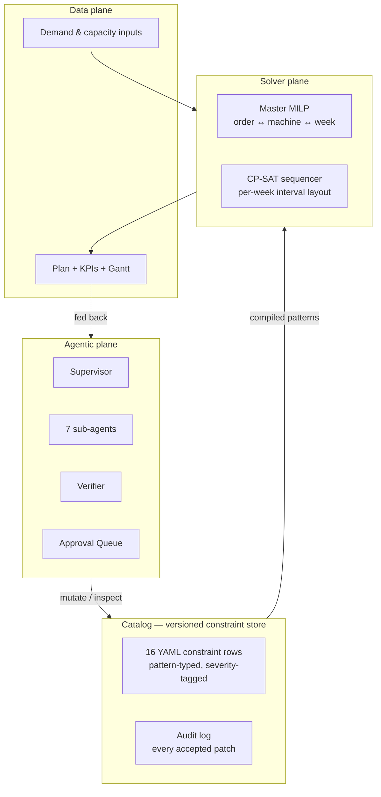
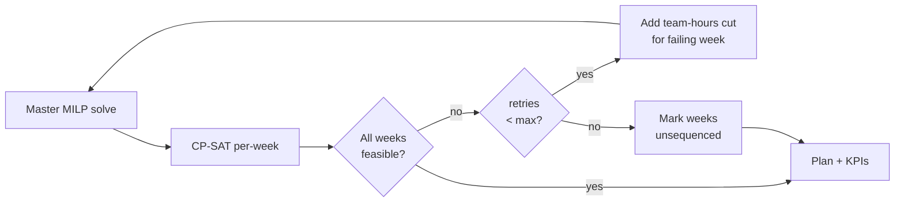
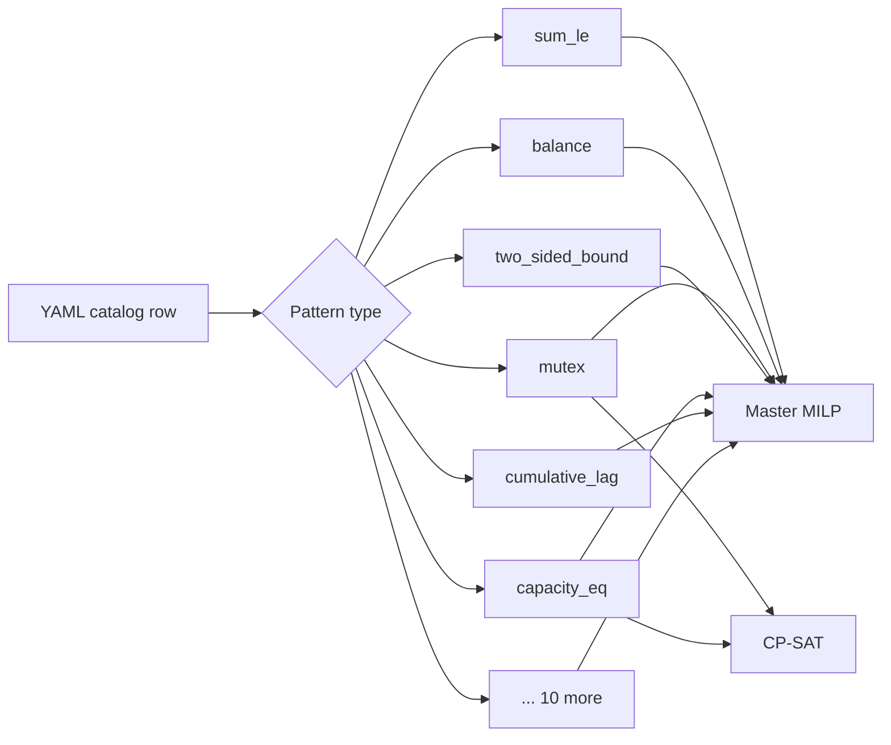
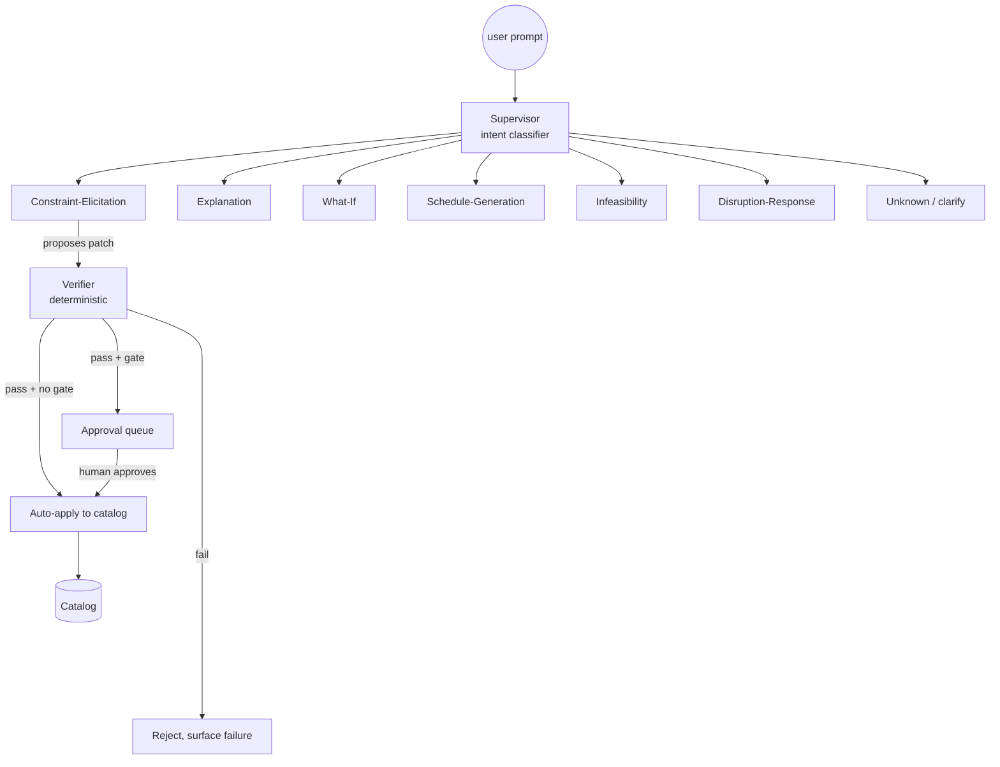
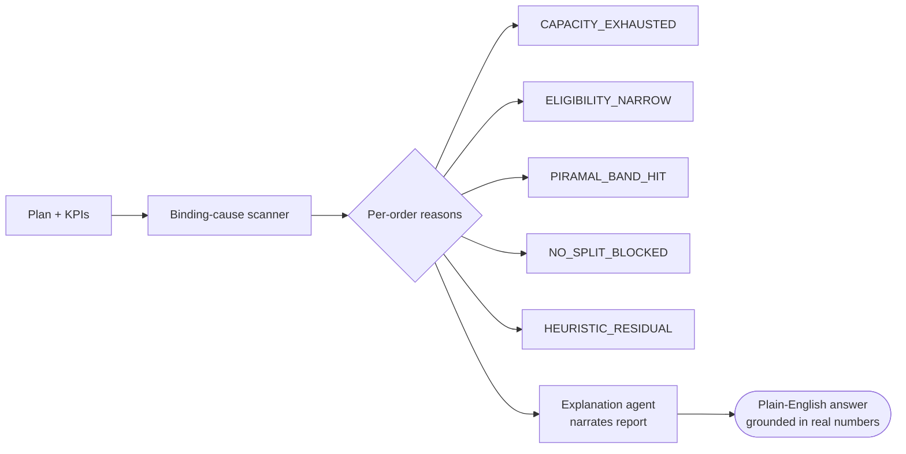
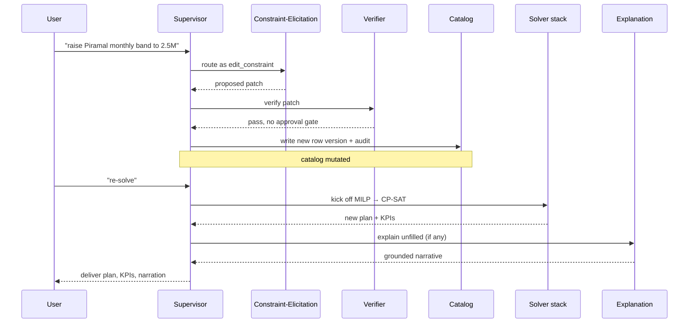

# Architecture — Solver Core + Agentic Layer

A pure-architecture view of how the two solver stages connect to each
other, and how the agent stack sits on top of them. No file paths, no
function names — just the conceptual shape.

---

## 1. The three planes

The system is one stack with three planes, communicating in a
strict downward direction at solve time and upward at govern time:



Solve-time flow runs top to bottom: agents inspect or mutate the
catalog; the catalog feeds compiled constraints to the two-stage
solver; the solver produces a plan. Govern-time flow runs bottom to
top: plan facts feed back into the agents so they can narrate,
diagnose, and propose the next mutation.

---

## 2. Solver plane — MILP master ↔ CP-SAT sequencer

The solver is split deliberately into two stages with different
strengths.

### 2.1 What each stage owns

```
+---------------------------------------------------------------+
|  MILP master  (quarterly allocation)                          |
|---------------------------------------------------------------|
|  Decides:                                                     |
|    - which order is packed on which machine in which week     |
|    - how much of each order goes into each cell               |
|    - which format each machine is set up for each week        |
|    - how many changeovers happen per machine                  |
|                                                               |
|  Optimises:                                                   |
|    - weighted sum of fulfilment, lateness, changeover,        |
|      idle, tie-fairness, Piramal band deviation               |
|                                                               |
|  Time grain:  one week per slot, 13 slots for Q1              |
|  Output:      assignments-by-(machine, week) + transitions    |
+---------------------------------------------------------------+
                              |
                              v   (per-week assignments + transitions)
+---------------------------------------------------------------+
|  CP-SAT sequencer  (within-week sequencing)                   |
|---------------------------------------------------------------|
|  Decides:                                                     |
|    - the exact start/end time (seconds) of every packing      |
|      interval inside a single week                            |
|    - the order in which formats are produced on each machine  |
|                                                               |
|  Enforces:                                                    |
|    - per-machine no-overlap                                   |
|    - global no-overlap on the changeover team                 |
|    - 168-hour weekly envelope per machine                     |
|                                                               |
|  Time grain:  seconds, intra-week                             |
|  Output:      Gantt-ready interval table                      |
+---------------------------------------------------------------+
```

The MILP cannot reason about wall-clock overlap between machines (a
single team handles changeovers across all four lines). The CP-SAT
cannot reason about which orders go where (its search space would
explode). They solve the same problem from two complementary angles.

### 2.2 The retry-cut loop

The MILP allocates *volumes*; the CP-SAT lays those volumes on the
*time axis*. Occasionally a week's MILP allocation cannot be sequenced
without violating the global changeover-team no-overlap. When that
happens we feed back a cut and re-solve the MILP:



Key properties of the loop:

- **Cuts are gentle.** Each retry shaves the team-hours cap by 10%, not
  in half. Aggressive halving was shown empirically to drop OTIF from
  100% to 45% — the solver overshoots correction.
- **A small headroom buffer** is added to the per-machine envelope
  before the loop ever runs, which absorbs the rounding difference
  between MILP minute-granularity and CP-SAT second-granularity.
  Most quarters never trigger a retry.
- **Transitions are read from the MILP, not re-derived.** The MILP's
  own changeover count is the contract — re-deriving it from
  prev-week activity over-counts changes across idle weeks the MILP
  never budgeted.

### 2.3 What goes between the two stages

```
                  MILP solution
                       |
                       v
       +-------------------------------+
       |  Per-week packet              |
       |    available_seconds: 432000  |
       |    assignments:               |
       |      machine_A: [order, qty]  |
       |      machine_B: [order, qty]  |
       |    transitions: list of       |
       |      (machine, from_fmt,      |
       |       to_fmt, hours)          |
       +-------------------------------+
                       |
                       v
                 CP-SAT for week
```

Nothing else crosses the boundary. The CP-SAT does not see other
weeks, the order pool, or the objective — only the time-axis problem
for the slice of work the MILP handed it.

---

## 3. Catalog — the single source of truth

Both solver stages read from the same versioned catalog. The catalog
is *not* a code module — it is a directory of declarative constraint
rows, each row carrying:

```
+--------------------------------------+
|  Constraint row                      |
|--------------------------------------|
|  id                                  |  C-037
|  name                                |  Piramal monthly band
|  category, severity, solver_layer    |  bands, soft, MILP_master
|  pattern + parameters                |  two-sided-bound on monthly sum
|  units                               |  monthly_min / monthly_max → units
|  business_rules (natural language)   |  "cannot go below 1.5M without
|                                      |   compliance approval"
|  owner, version                      |
+--------------------------------------+
```

### 3.1 How rows reach the solvers



Each pattern is a small, reusable compiler — it knows how to translate
one declarative row into the right kind of decision variable, slack
variable, or interval constraint. Adding a new constraint type means
adding a new pattern and a new compiler. Adding a new constraint of an
existing type means dropping in a YAML file. The MILP and CP-SAT
compositions are *generated from* the catalog at every solve.

### 3.2 Why both planes read the same store

```
            Catalog
           (one file
            per rule)
                 |
        +--------+--------+
        |                 |
        v                 v
    Solver plane     Agentic plane
   compiles rows    inspects + mutates
   into a model     rows through Verifier
```

Because both planes read from the same place, when an agent applies a
patch and the solver re-runs, *every* downstream piece — Gantt, KPIs,
unfilled-orders report, narration — reflects the new constraint
without any manual wiring. The catalog is the contract between
governance and computation.

---

## 4. Agentic plane

Seven sub-agents sit behind a single Supervisor. The Supervisor
classifies each user message into one of seven intents and routes the
work; the sub-agents do the actual reasoning; the Verifier polices any
mutation before it can affect a future solve.

### 4.1 The agent graph



Intents:

| Intent              | What the sub-agent does                            |
|---------------------|----------------------------------------------------|
| edit_constraint     | Translate prose into a structured catalog patch    |
| explain             | Narrate the current plan for a persona             |
| whatif              | Compare two plans and explain the delta            |
| run_scheduler       | Kick off a re-solve                                |
| infeasibility       | Explain which constraints made a week impossible   |
| disruption          | Re-plan around a sudden change (machine down etc.) |
| unknown             | Ask the user to clarify                            |

### 4.2 The Verifier as trust boundary

The crucial property of the stack is that the Verifier is **fully
deterministic** — it contains no language model. Every patch, no
matter how confidently an LLM produced it, must clear five checks
before it can affect a future solve:

```
                    [ LLM-proposed patch ]
                              |
                              v
       +-----------------------------------------+
       |              VERIFIER                   |
       |-----------------------------------------|
       |  1. Schema check                        |
       |       (right fields, right types)       |
       |  2. Unit check                          |
       |       (parameters carry the same unit   |
       |        the constraint declared)         |
       |  3. Business-rule check                 |
       |       (scan natural-language rules,     |
       |        flag approval gates)             |
       |  4. Feasibility check  (optional)       |
       |       (run a quick re-solve in a        |
       |        staged copy of the catalog)      |
       |  5. Audit append                        |
       |       (record actor, rationale, diff)   |
       +-----------------------------------------+
                              |
                ----+---------+---------+----
                    v                   v
           [ approval gate ]    [ ready to apply ]
                    |                   |
                    v                   v
            [ human review ]   [ catalog mutation ]
```

This is what lets the LLMs be opinionated without being load-bearing on
correctness. The Verifier is the contract that says *"the plan you are
about to compute is not allowed to come from a constraint set that
violates the unit system, the schema, or any explicit human guard
the planner wrote in plain English."*

### 4.3 Grounded narration

When the user asks "why are these orders unfilled?", the narrating
agent does **not** ask the LLM to guess. A deterministic scanner first
reads the plan and produces a grounded report:



The scanner computes per-machine-week utilisation, per-format supply
vs demand, Piramal monthly volumes against the band, no-split
membership — all from the actual plan, not from priors. Only then is
the report handed to the LLM with an instruction not to invent orders.
The LLM's freedom is in the prose, not in the facts.

---

## 5. End-to-end loop: prompt to plan

A typical "the customer wants a higher Piramal cap, what would that
get us?" interaction flows through every plane:



Two decision points keep this safe:

- **Apply gate** — between Verifier and catalog write. A patch that
  fails any check, or trips an approval gate, never reaches the
  catalog. Auto-application is the exception; human-in-the-loop is the
  default for anything with a business-rule guard.
- **Solve gate** — between catalog and solver. Solves are expensive
  (5–10 min on Q1), so they never fire on apply. The user (or a
  Disruption-Response trigger) explicitly asks for the re-solve.

---

## 6. Why this shape

The split exists because three different reasoning styles are needed
to plan production cleanly:

| Concern                       | Right tool        | Reason                                                  |
|-------------------------------|-------------------|---------------------------------------------------------|
| Weekly volume allocation      | MILP              | Linear objectives, network-flow shape, capacity caps    |
| Sequencing within a week      | CP-SAT            | Native intervals + no-overlap + cumulative resources    |
| Natural-language governance   | LLM agent stack   | Translate prose into structured patches                 |
| Correctness of any mutation   | Deterministic     | Trust must not depend on a sampled token distribution   |
| Narration of any number       | LLM + grounded   | Pretty prose over a structured report, never priors     |

Every layer does exactly what it is good at. The interfaces between
them — per-week packet from MILP to CP-SAT, structured patch from
agent to Verifier, grounded report from scanner to narrator — are
narrow, typed, and the same shape every time.

That is the whole picture: a two-stage solver fed by a versioned
constraint catalog, an agent stack that mutates the catalog through a
deterministic gate, and a grounded narration path that never lets the
language model fabricate the numbers it talks about.
